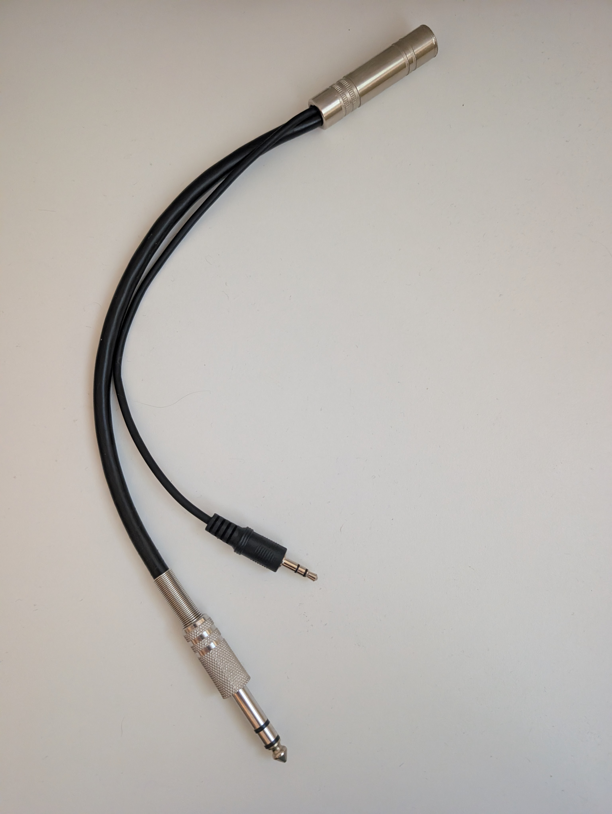
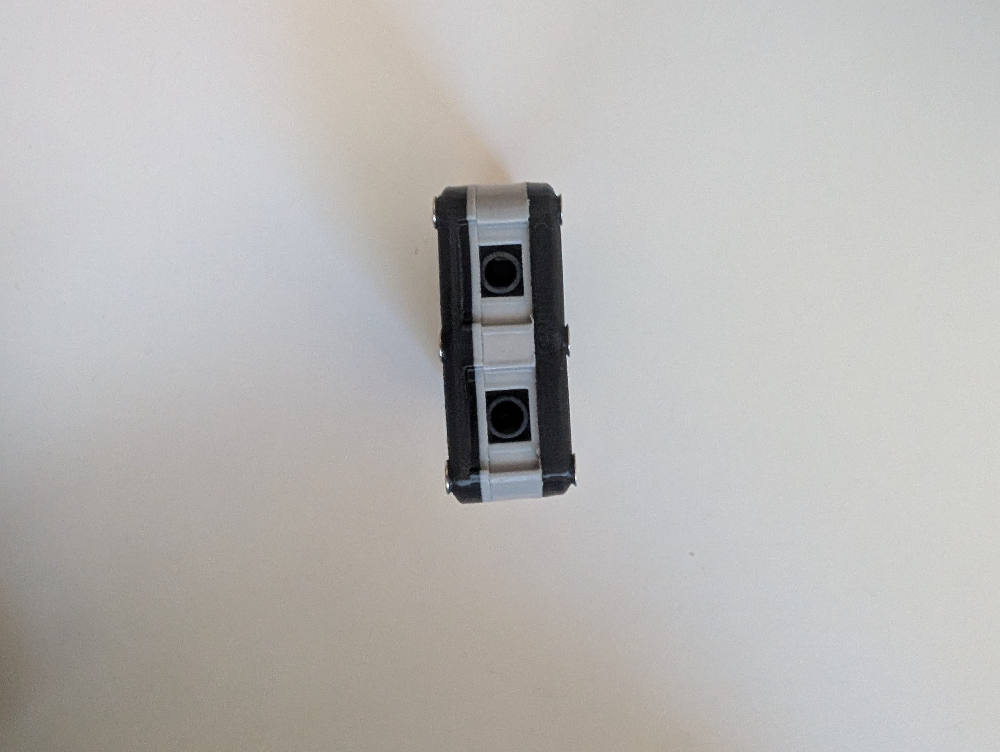
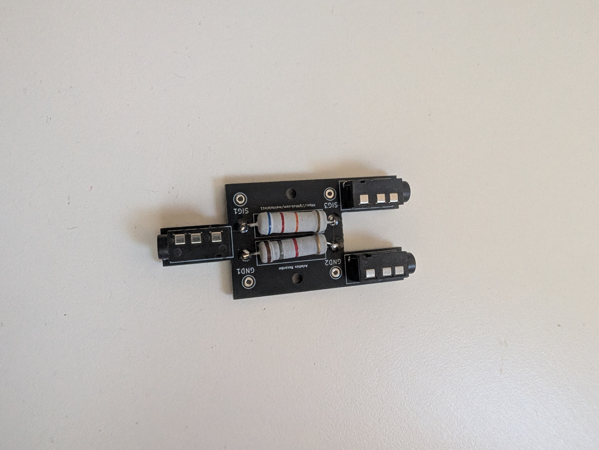

# GA Cockpit Recorder — TRS+TRRS Adapter


A small adapter PCB and 3D-printed enclosure for recording audio from a
general aviation (GA) cockpit intercom onto a phone, dictaphone, action
camera, or other consumer recorder.

The board breaks out a GA intercom feed into both **3.5 mm TRS** and
**3.5 mm TRRS** jacks so it can be connected to almost any recording device:

- **TRS** — line-style stereo output (standard recorders, line-in inputs).
- **TRRS** — phone-style 4-conductor output (smartphones, headsets that
  expect a mic on the ring/sleeve).

## Important: this is only the adapter

This board does **not** plug directly into the aircraft. To use it you also
need:

1. **A PL splitter** for the cockpit GA jacks (the dual PJ-055 / PJ-068
   "PL" connectors used in GA aircraft). The splitter taps the intercom
   audio without disconnecting the pilot's headset.
2. **A PL-to-TRS cable or adapter** that connects the splitter to this
   adapter board's input jack.

Signal chain:

```
Cockpit GA jacks ── PL splitter ── PL-to-TRS cable ── [this adapter] ── phone / recorder
```

Example of the PL-to-TRS cable that feeds the adapter:



## Connections

| Side | Photo | Description |
|---|---|---|
| Input  |  | TRS jack — connect the PL-to-TRS cable from the PL splitter here. |
| Output |  | TRS + TRRS jacks — connect a phone, action camera, or recorder. |

## Repository layout

```
pcb/                          KiCad 9 project
  Recorder-TRS+TRRS.kicad_pro     project file
  Recorder-TRS+TRRS.kicad_sch     schematic
  Recorder-TRS+TRRS.kicad_pcb     PCB layout
  PJ-320A.kicad_sym               vendored symbol (upstream ships only legacy .lib)
  PJ-320A_KiCad_Library/          git submodule -> nathanhborger/PJ-320A_KiCad_Library
  sym-lib-table / fp-lib-table    project-local library tables (KIPRJMOD-relative)

case/                         3D-printable enclosure
  top.stl / middle.stl / bottom.stl
  case.3mf                    source file with all parts

pictures/                     photos of the assembled board and case
```

## Opening the KiCad project

The footprint library is a git submodule, so clone with submodules:

```sh
git clone --recurse-submodules git@github.com:meirtolpin11/GA-Cockpit-Recorder-PCB.git
```

If you already cloned without `--recurse-submodules`:

```sh
git submodule update --init
```

Then open `pcb/Recorder-TRS+TRRS.kicad_pro` in KiCad 9.

The project ships its own `sym-lib-table` and `fp-lib-table` using
`${KIPRJMOD}`-relative paths, so no global KiCad library registration is
needed. If you already have a `PJ-320A` / `PJ-320A_Library` entry in your
global tables you may see a duplicate-nickname warning — the project-local
entry is the one that resolves correctly for this project.

## Generating gerbers

Gerbers are not committed (the design is the source of truth). To produce
manufacturing files:

1. Open the PCB in KiCad.
2. **File → Fabrication Outputs → Gerbers** — use your fab house's preset
   (e.g. JLCPCB, PCBWay) or the KiCad defaults.
3. **File → Fabrication Outputs → Drill Files** — Excellon, PTH + NPTH.
4. Zip the resulting folder and upload to your fab.



## Printing the case

The case prints in three parts (`top.stl`, `middle.stl`, `bottom.stl`).
`case.3mf` is the source file containing all parts together — open it in
your slicer if you'd like to print the set in one job.

<p>
  
  
</p>

## Credits

This design is based on the wiring scheme described in this
[Rivet Bangers forum thread](https://www.rivetbangers.com/forums/viewtopic.php?t=4753).

Special thanks to forum user **bullojm1** for sharing the original idea and
schematic — without that write-up this adapter would not exist. Thank you!

## License

This project is licensed under the **Creative Commons
Attribution-NonCommercial-ShareAlike 4.0 International License**
([CC BY-NC-SA 4.0](https://creativecommons.org/licenses/by-nc-sa/4.0/)).

You are free to share and adapt the design for **non-commercial** purposes,
provided you give credit and release your contributions under the same
license. Commercial use is not permitted without prior written permission.
See [`LICENSE`](LICENSE) for the full text.

The PJ-320A library submodule is © its respective authors and used under
the terms of its own repository.
